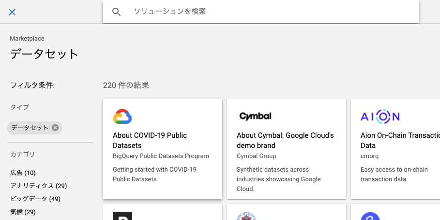

# デモ1

BigQueryは主に以下の方法で利用できます。

* BigQuery UI(ユーザーインターフェース)
* 各種SDK
* コマンドラインツール(bqコマンド)

この中で、最も利用する頻度が高く馴染みやすいのは、BigQuery UIでしょう。BigQuery UIからはテーブルを作成するなどといった基本操作とクエリによる分析が可能です。

本ラボでは、BigQuery UIでできることを理解し、実際にクエリエディタを用いてSQLによる分析を行います。

## 手順

1. 事前準備
2. BigQuery UIの説明
3. 一般公開データセットの追加
4. クエリを発行

### 事前準備

1. Google Cloud Console の [プロジェクト セレクタ] ページで、Google Cloud プロジェクトを選択または作成する

2. Cloud プロジェクトに対して課金が有効になっていることを確認する

【参考】[プロジェクトに対して課金が有効になっていることを確認する方法を学習する](https://cloud.google.com/billing/docs/how-to/modify-project?hl=ja)

※このチュートリアルを終了した後、作成したリソースまたはプロジェクトを削除してください。削除しない場合、リソースに対して請求が継続する可能性があります。

## BigQuery UIの説明

1. Google Cloud PlatformのナビゲーションメニューからBigQueryを選択する


2. BigQuery UI上でエディタタブを無効にする


※必須ではないですが、UIがシンプルになるため、今回はエディタタブ無しで解説します。

`UIの説明`


|  項目  |  説明  |
| ---- | ---- |
|クエリエディタ|ここにSQLを記入しクエリを実行する|
|クエリ履歴|クエリの履歴を確認する。個人またはプロジェクトレベルで保存される|
|保存したクエリ|任意のSQL文を保存する|
|ジョブ履歴|データのインポートまたはエクスポート等のジョブ履歴を確認する|
|転送|様々なデータソースからBigQueryへデータを転送する|
|スケジュールされたクエリ|定期実行されるクエリを管理する|
|モニタリング|BigQueryの使用状況を確認する|
|BI Engine|インメモリ分析エンジンであるBI Engineの管理を行う|
|リソース|BigQueryで利用出来るリソース（データセット等）を表示する|

3. 公開データセットを追加する

BigQueryUIから一般公開データセットを追加します。


データセット一覧から「Austion Crime Data」を選択します。（検索バーでデータ名を打ち込んで下さい。）




データセットが追加されていることをBigQuery UI上でも確認します。


4. データに対してクエリを実行する

以下のクエリをクエリエディタに入力します。

```sql
SELECT
  unique_key
FROM
  `bigquery-public-data.austin_crime.crime`
LIMIT
  1000
```

クエリを実行すると、以下のように結果が表示されます。


これが、BigQueryでクエリを実行する時の基本操作です。

# デモ2

BigQueryでクエリを実行する際には、そのクエリのデータのスキャンと計算時間に注意が必要です。
クエリが整えられていないと、データのスキャン量が増えて課金が余計に生じ、まわりくどいクエリは計算量を増加させ、結果を得るまでに時間がかかります。
これらをなるべく小さくするようにクエリを整形することを、クエリ最適化といいます。

クエリ最適化を考える際に最も重要なことは、スキャン量を小さくすることです。スキャン量を小さくすれば、料金と計算時間の両方を減少させることが可能です。
スキャン量を小さくできたのであれば、次に効率の良いSQL文を考えると良いでしょう。

このデモでは、いくつかのSQLを実際に実行して、スキャン量や計算時間がどのように変化するのかを以下の項目で確認します。

* "SELECT *"を実行した際のスキャン量の比較
* LIMIT句,WHERE句をした際のスキャン量の比較

## "SELECT *"をした際のスキャン量の比較

BigQueryは列指向アーキテクチャといわれ、データのスキャンも列単位で行います。
従って、"SELECT *"のようにテーブルのデータの全ての列に対してクエリを実行すると、スキャン量が最大になります。必要な場合以外は避けるようにしましょう。
先程のクエリを変形した以下のSQL文をクエリエディタに入力し、スキャン量を確認します。

```sql
SELECT
  *
FROM
  `bigquery-public-data.austin_crime.crime`
LIMIT
  1000
```


## LIMIT句,WHERE句を利用した場合のスキャン量の比較

結論から書くと、これらのフィルタはデータのスキャン量を小さくすることに繋がりません。
SQLの実行順序を理解していると、この挙動は必然だと理解できるので、興味のある方はSQLの各句の実行順序を調べてみてください。

ただし、後述する`パーティションテーブル`では、WHERE句によってデータをスキャンするテーブルを絞り込むことができるため、データのスキャン量に大きく寄与します。

以下のSQLをクエリエディタに入力し、スキャン量を確認します。

```sql
SELECT
  *
FROM
  `bigquery-public-data.austin_crime.crime`
WHERE
  address = "Austin, TX"
LIMIT
  1000
```

スキャン量が小さくなっていないことと、実行結果のレコード数が少なくなっていることが確認できます。


LIMIT句についても同様に確認します。

```sql
SELECT
  *
FROM
  `bigquery-public-data.austin_crime.crime`
```


# デモ3

効率よくクエリを記述する以外にも、スキャン量削減と計算効率化の両方を実現する方法があります。
テーブル作成時にテーブルの分割に関する設定を利用することです。

BigQueryのテーブル設定には、「パーティションテーブル」と「クラスタ化テーブル」の2種類が存在し、それぞれを適切に利用することでクエリを最適化する以上の効果があります。
それぞれのテーブルを作成し、実際にクエリを実行してその効果を確認していきます。

## 手順

1. Datasetの作成
2. 同一データからのパーティションテーブルと通常テーブルの作成
3. パーティションテーブルと通常テーブルの比較
4. クラスタ化テーブルの作成と通常テーブルとの比較

## Datasetの作成

UI上から、今回のテーブルを格納するデータセットを作成します。


作成ページにて、「データセットID」だけを入力し作成ボタンを押します。（このデータセットIDは利用するので、メモしておいてください。）


UI上のリソースセクションで作成したデータセットを確認します。

## 同一データからのパーティションテーブルと通常テーブルの作成

これより先は、SQL中の"DATASET"部分をご自身のデータセット名に置換して実行してください。
以下のクエリでは、パーティションのあるテーブルとないテーブルがそれぞれ作成されます。

```sql
# パーティション有り
CREATE TABLE
  `DATASET.wikipedia_partitioned`
PARTITION BY
  DATE(partition_timestamp) AS
SELECT
  *,
  TIMESTAMP_SECONDS(timestamp) AS partition_timestamp
FROM
  `bigquery-public-data.samples.wikipedia`
WHERE
  timestamp < 1136041200
```

```sql
# パーティション無し
CREATE TABLE
  `DATASET.wikipedia_not_partitioned`
AS
SELECT
  *,
  TIMESTAMP_SECONDS(timestamp) AS partition_timestamp
FROM
  `bigquery-public-data.samples.wikipedia`
WHERE
  timestamp < 1136041200
```

今回利用したデータソースは、wikipediaの公開データセットです。
簡単にクエリについても説明します。

* CREATE TABLE 構文を利用
* PARTITION_BY で分割に用いる TIMESTAMP または DATE カラム を指定
* unixtime 表記の timestamp カラムを TIMESTAMP 型に変更し 分割に利用
* 割当(ソフトリミット)回避のため、特定期間をWHERE句で指定

UI上のリソースセクションで作成したテーブルを確認します。

## パーティションテーブルと通常テーブルの比較

以下のSQLを実行し、スキャン量と処理時間を確認します。

```sql
SELECT
  title
FROM
  `DATASET.wikipedia_partitioned`
WHERE
  DATE(partition_timestamp) = "2001-11-02"
```

```sql
SELECT
  title
FROM
  `DATASET.wikipedia_not_partitioned`
WHERE
  DATE(partition_timestamp) = "2001-11-02"
```

パーティション有りの方は、スキャン量が少なくなっていることが確認出来るはずです。
これは、パーティションテーブルでは`partition_timestamp`から日付を計算し、内部ではその日付ごとにテーブルが作成されているためです。

## クラスタ化テーブルの作成と通常テーブルとの比較

続いてクラスタ化テーブルを作成し、クエリを実行します。
クラスタ化テーブルは大きなデータ量がないと効果を実感しづらいため、別のデータセットを利用します。

まずは以下のSQLを実行してテーブルを作成します。クエリの「DATASET」部分を置換して実行してください。

```sql
CREATE TABLE
  DATASET.sf_badges_cluster
CLUSTER BY
  name AS
SELECT
  *
FROM
  `bigquery-public-data.stackoverflow.badges`
```

UI上のリソースセクションで作成したテーブルを確認します。

その後実際に作成したテーブルと元テーブルとで集計処理の時間を比較します。
以下の2つのクエリを実行します。

```sql
SELECT
  name,
  COUNT(name)
FROM
  `DATASET.sf_badges_cluster`
GROUP BY
  name
```

```sql
SELECT
  name,
  COUNT(name)
FROM
  `bigquery-public-data.stackoverflow.badges`
GROUP BY
  name
```

クラスタ化テーブルの方が早く終了したはずです。これは、"name"列を用いてクラスタ化したため、"name"で集計処理をする場合に非常に高速に計算できるためです。

このように、特定の列に集計処理を行う場合はクラスタ化テーブルが有効です。

# 最後に

作成したデータセットを削除しましょう。
以上でBigQuery道場のデモは終了です。ありがとうございました。
