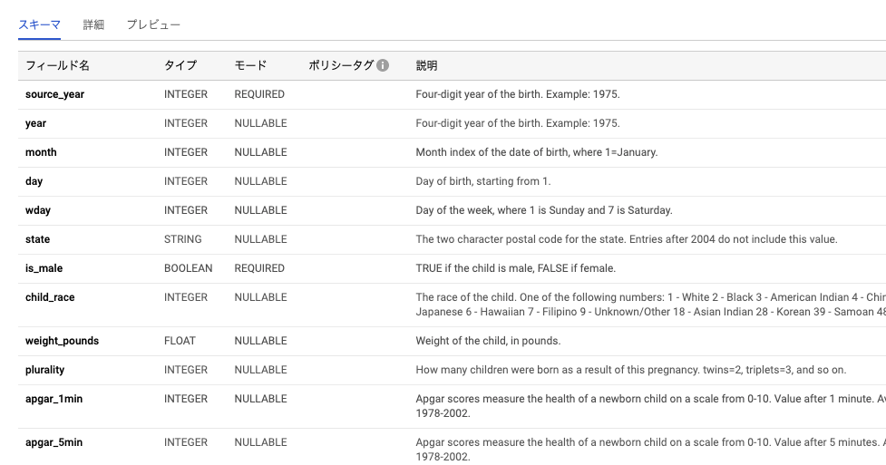
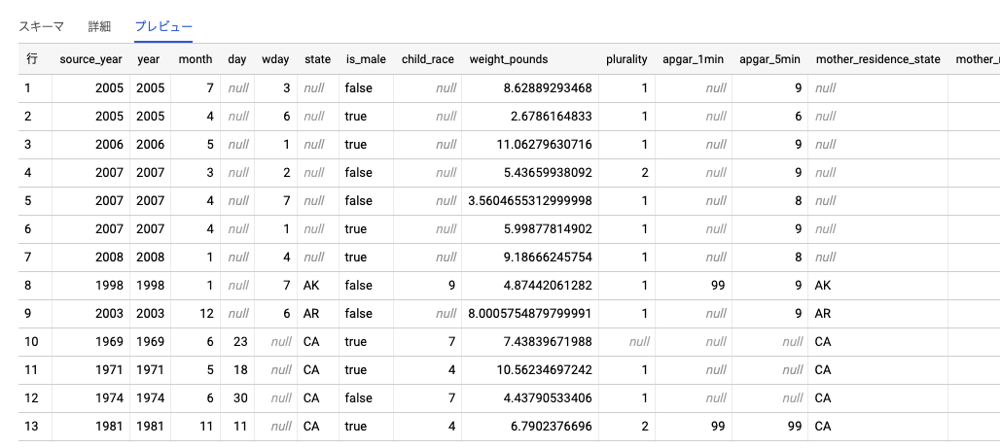
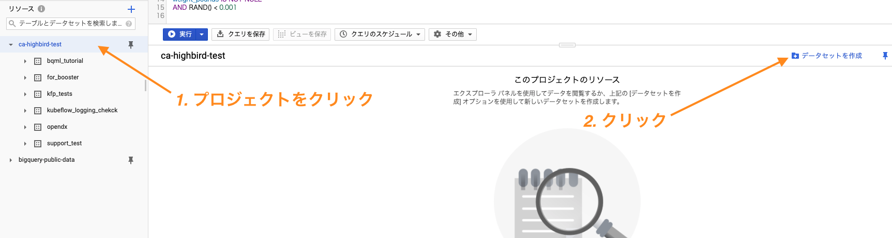
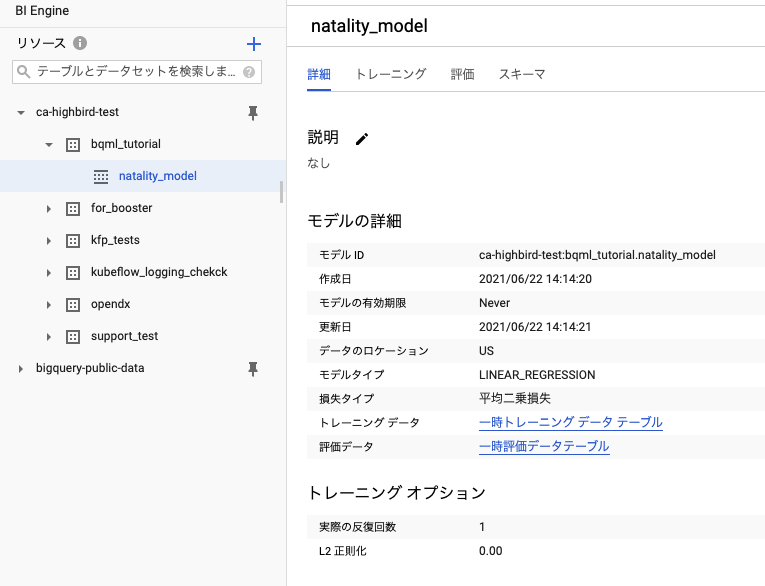

# デモ1

本ラボでは、BigQuery MLで簡単な回帰モデルを作成します。
モデルの作成のデータとして、BigQueryで公開されている bigquery-public-data:samples.natality を利用します。このデータは、出産時の母子データを保存しています。

今回行うタスクは一貫して「出生児の体重を予測する」です。従って、連続値の予測である回帰予測のアルゴリズムを利用します。

今回利用するBQMLのアルゴリズムは、「BoostedTree_REGRESSOR」を利用します。このアルゴリズムは、勾配ブースティング木の実装の１つであるXGBoostを内部で利用しており、比較的高い性能が一般に得られます。

## 手順

1. 事前準備
2. 一般公開データセットの追加と確認
3. データセットの作成
4. モデルの作成
5. 作成したモデルの確認

### 事前準備

1. Google Cloud Console の [プロジェクト セレクタ] ページで、Google Cloud プロジェクトを選択または作成する

2. Cloud プロジェクトに対して課金が有効になっていることを確認する

【参考】[プロジェクトに対して課金が有効になっていることを確認する方法を学習する](https://cloud.google.com/billing/docs/how-to/modify-project?hl=ja)

※このチュートリアルを終了した後、作成したリソースまたはプロジェクトを削除してください。削除しない場合、リソースに対して請求が継続する可能性があります。

## 一般公開データセットの追加と確認

1. Google Cloud PlatformのナビゲーションメニューからBigQueryを選択する


2. BigQuery UI上でエディタタブを無効にする


※必須ではないですが、UIがシンプルになるため、今回はエディタタブ無しで解説します。

3. [リンク](https://console.cloud.google.com/bigquery?p=bigquery-public-data&d=samples&t=natality&page=table&_ga=2.267778822.921902387.1630293998-1214351729.1629081575)をクリックし、データセットを追加

4. データセットの中身を確認する

今回利用するカラムは以下になります。BigQuery UI上から、これらのスキーマと実際の値を確認しておきます。

| カラム名  |  説明  |
| ---- | ---- |
|weight_pounds|ポンド単位の子供の体重|
|is_male| 子供の性別 |
|gestation_weeks| 妊娠期間 |
|mother_age| 報告された出産時の母親の年齢 |
|mother_race| 母親の人種に対応する整数値 |



「mother_race」が整数型であることを特に注意します。モデルに利用する際は、これらを数値データでない形で扱います。



## データセットの作成

BigQuery UI上からデータセット作成を行います。
データセット名は任意ですが、後ほど使うので利用しやすい名前にしましょう。




## モデルの作成

以下のSQLを利用してモデル作成を行います。クエリエディタにクエリを入力し実行します。
SQL中の"DATASET"部分をご自身のデータセット名に置換して実行してください。
また"MODEL"部分は、任意の英数字でモデル名を定義して下さい。

モデル作成まで数分かかります。

```sql
#standardSQL
CREATE MODEL `DATASET.MODEL`
OPTIONS
  (model_type='BOOSTED_TREE_REGRESSOR',
    input_label_cols=['weight_pounds']) AS
SELECT
  weight_pounds,
  is_male,
  gestation_weeks,
  mother_age,
  CAST(mother_race AS string) AS mother_race
FROM
  `bigquery-public-data.samples.natality`
WHERE
  weight_pounds IS NOT NULL
  AND RAND() < 0.001
```

## 作成したモデルの確認

作成したモデルはデータセットの中に配置されます。BigQuery UI上から確認してみましょう。

UI上から、以下を確認することが確認できます。

| セクション名 |  説明  |
| ---- | ---- |
|詳細|モデルの作成日時、パラメータ等の確認ができます。|
|トレーニング|訓練中の損失関数の減少を確認できます。|
|評価|訓練済みモデルの性能を表示します。この際に利用されているデータは、訓練データから予め別に取っておいたデータです。|
|スキーマ| 特徴量、ラベルの情報が確認できます。|



# デモ2

デモ1では、モデルアルゴリズムのハイパーパラメータを明示的に指定しませんでした。

`OPTIONS`句内でこれらのハイパーパラメータを指定することが可能です。
ハイパーパラメータは人の手で決めるものですので、こうやれば良いという正解はありません。

さらにBQMLでは、複数候補を渡し、その中から最もよい組み合わせを自動で選択することが可能です。
ハイパーパラメータチューニング自動化の手順を本デモでは紹介します。

## 手順

1. モデル作成
2. 結果の確認

## モデル作成

利用しているモデルアルゴリズムは"BOOSTED_TREE_REGRESSOR"でした。
今回は、「木の深さの最大値」を指定するパラメータを調整します。
（その他のパラメータは、[リンク先](https://cloud.google.com/bigquery-ml/docs/reference/standard-sql/bigqueryml-syntax-create-boosted-tree#tree_method)を確認して下さい。）

以下SQLを利用します。同様に、クエリエディタへクエリを入力し実行します。
SQL中の"DATASET"部分をご自身のデータセット名に置換して実行してください。
また"MODEL"部分は、任意の英数字でモデル名を定義して下さい。

```sql
#standardSQL
CREATE MODEL `DATASET.MODEL` 
OPTIONS (model_type='BOOSTED_TREE_REGRESSOR',
    input_label_cols=['weight_pounds'],
    num_trials=6,
    max_parallel_trials=2,
    MAX_TREE_DEPTH=HPARAM_RANGE(4,
      12) ) AS
SELECT
  weight_pounds,
  is_male,
  gestation_weeks,
  mother_age,
  CAST(mother_race AS string) AS mother_race
FROM
  `bigquery-public-data.samples.natality`
WHERE
  weight_pounds IS NOT NULL
  AND RAND() < 0.001
```

モデル作成はdemo1より時間がかかります。
今回指定したのは、トライアル数とハイパーパラメータのみでしたが、他にも以下を指定してハイパーパラメータ調整が可能です。

* チューニングアルゴリズムの指定
* 調整目標の指定
* 分割方法の指定

## 結果の確認

パラメータチューニングした後、このモデルを利用する場合は、一番性能が良いモデルが利用されます。

しかし、各々のトライアルについて詳細を確認したい場合もあります。

この場合、以下クエリを実行します。

```sql
#standardSQL
SELECT * FROM 
    ML.TRIAL_INFO(MODEL `DATASET.MODEL`)
```

各トライアルごとの評価指標とパラメータの値、どれが最も良いトライアルだったかを確認できます。

# デモ3

作成したモデルへ評価と予測を行います。

# 手順

* モデルへの評価
* モデルへの予測

## モデルへの評価

この場合の評価とは、訓練データ以外のデータを利用して性能を測り、訓練と比較して性能が落ちていないかそもそも性能自体が低くないか等を確認することです。

BQMLは、デフォルトで、訓練時に予め訓練用と評価用でデータを分割して訓練し、モデル作成後その値を見ることが可能です。しかし、定期的に他のデータに対してモデルを評価したい時などには、訓練時の値とは別に評価値を算出する必要があります。

ここで利用するのが、`ML.EVALUATE`関数です。

以下のクエリを打ち込んで結果を確認してみましょう。
"`DATASET.MODEL"内のDATASETとMODELは、それぞれデモ1で作成したものに置換して下さい。

```sql
#standardSQL
SELECT
  *
FROM
  ML.EVALUATE(MODEL `DATASET.MODEL`,
    (
    SELECT
      weight_pounds,
      is_male,
      gestation_weeks,
      mother_age,
      CAST(mother_race AS STRING) AS mother_race
    FROM
      `bigquery-public-data.samples.natality`
    WHERE
      weight_pounds IS NOT NULL))
```

回帰モデルでは以下の様な指標について結果が出てくるでしょう。

* mean_absolute_error
* mean_squared_error
* mean_squared_log_error
* median_absolute_error
* r2_score
* explained_variance

どの指標を見るべきかは問題設定によります。詳細な説明は割愛します。

## モデルへの予測

最後に、作成したモデルへ予測を行いましょう。`ML.PREDICT`関数を利用します。

以下のクエリを打ち込んで結果を確認してみましょう。
"`DATASET.MODEL"内のDATASETとMODELは、それぞれデモ1で作成したものに置換して下さい。

```sql
#standardSQL
SELECT
  is_male,
  gestation_weeks,
  mother_age,
  mother_race,
  predicted_weight_pounds
FROM
  ML.PREDICT(MODEL `DATASET.MODEL`,
    (
    SELECT
      is_male,
      gestation_weeks,
      mother_age,
      CAST(mother_race AS STRING) AS mother_race
    FROM
      `bigquery-public-data.samples.natality`
    WHERE
      state = "WY"))
```

入力した特徴量と予測結果がテーブルとして返って来ます。


# 最後に

モデル作成、評価、予測の流れを確認しました。
一通り試し終えたら、作成したデータセットを削除しましょう。

以上で、BigQuery ML道場のデモは終了です。ありがとうございました。
